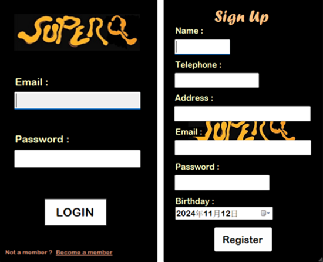
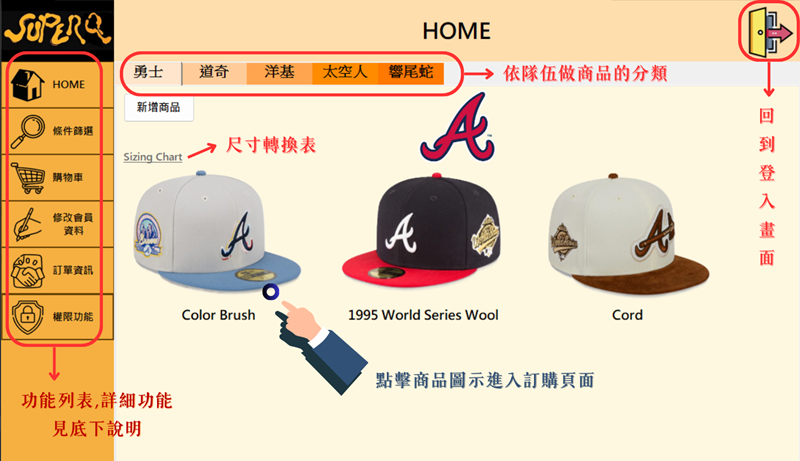
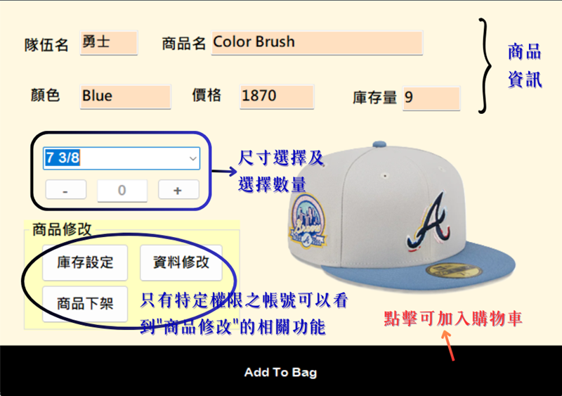
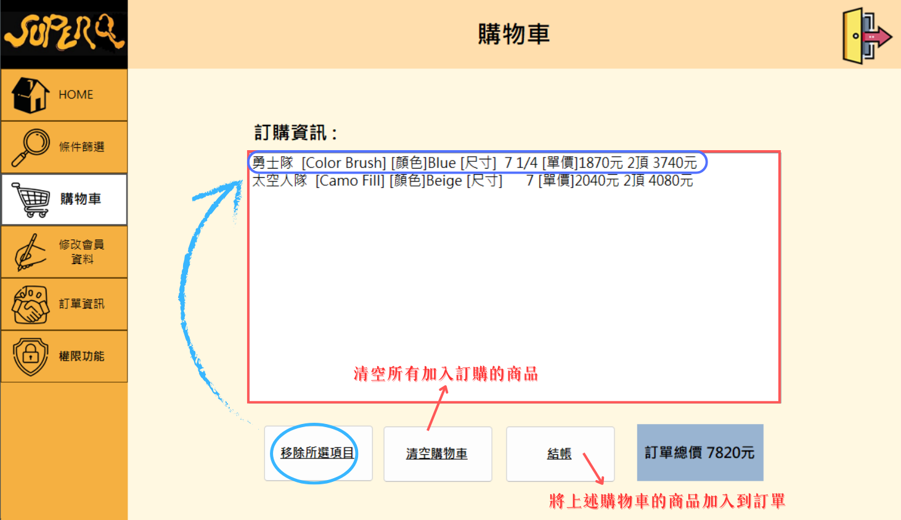
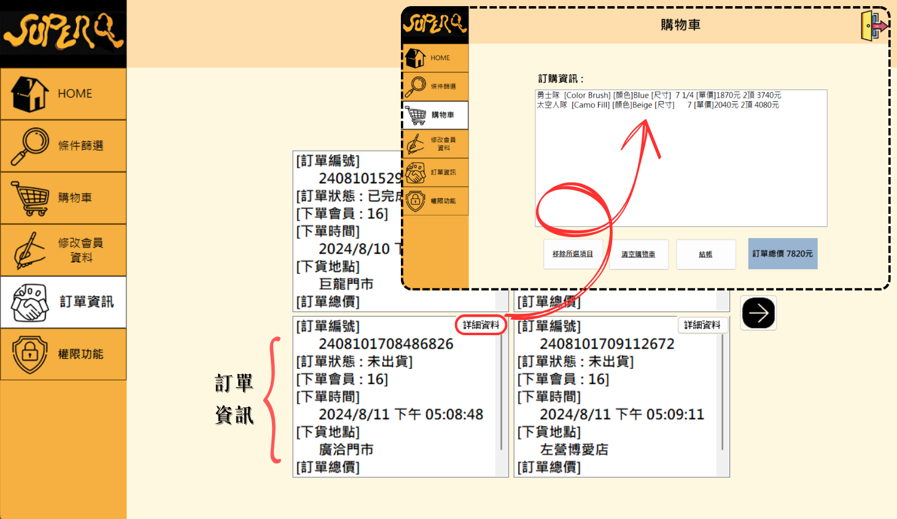
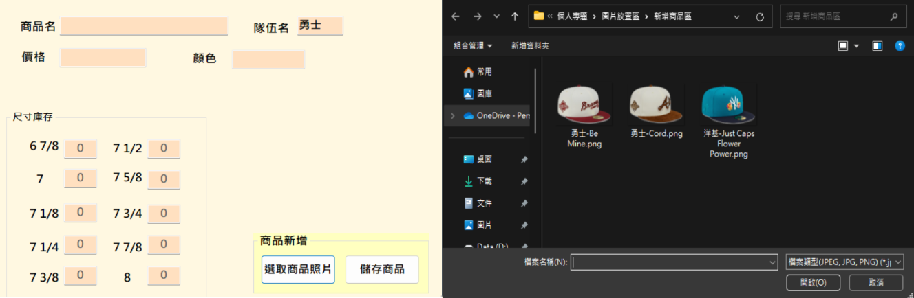

# 💡專案簡介
這是一個以**全封帽**為主題,所設計的**銷售系統**,介面主要用**Windows Form**設計,資料庫管理則使用**SQL Server**

# ✨文件說明
[https://drive.google.com/file/d/1kOlSlvcu5bqUXC0j-z0CksV_xPDFkVf2/view?usp=sharing](https://)

# 👀操作畫面
### 登入及註冊介面
註冊時的Email有基本格式限制 *xxx @ xxx . xx* 電話則必須為 *09開頭+八位0~9* 的任意組合
如不想註冊有提供測試帳號密碼
```
帳號： 777@gmail.com
密碼： 7777777
```


### 首頁


### 商品頁面


### 購物車頁面


### 訂單頁面


### 新增商品頁面


